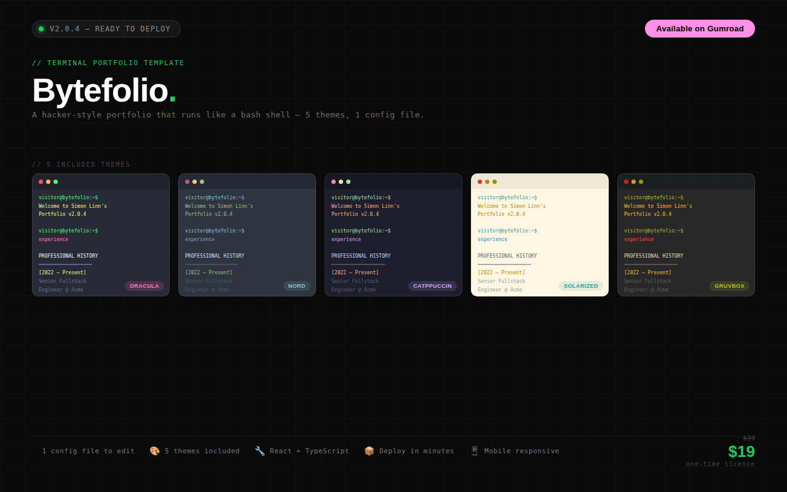

# Bytefolio — Terminal Portfolio Template

A developer portfolio that lives entirely inside a terminal emulator.
Built with Next.js 14, TypeScript, and Tailwind CSS. Fully responsive, dark-by-default, and customisable in a single file.


---

## Preview

> Five built-in themes — GitHub Dark, Matrix Green, Amber CRT, Cyber Blue, Light Mode.

---

## Features

**Terminal experience**

- Full command-line interface with tab-completion and command history
- Virtual file system — `ls`, `cd`, `cat`, `tree`, `pwd` all work as expected
- `neofetch` system overview with ASCII art
- `man` pages for built-in commands
- Keyboard shortcuts: `Ctrl+C`, `Ctrl+L`, `Ctrl+U`, `Ctrl+K`, `Ctrl+A`, `Ctrl+E`, arrow keys

**Split pane**

- Split the terminal horizontally (side by side) or vertically (top / bottom)
- Each pane is fully independent — own history, working directory, and input
- Click any pane to focus it; close with the × button in the pane tab

**AI-powered project summaries** _(optional)_

- `open <project>` generates a contextual project summary via the Anthropic API
- Falls back gracefully to static data if no API key is set

**Themes**

- GitHub Dark (default)
- Matrix Green
- Amber CRT
- Cyber Blue
- Light Mode
- CRT scanline and glow overlay (auto-hidden in light mode)

**Developer ergonomics**

- One-file customisation — edit only `src/lib/portfolio-data.ts`
- TypeScript throughout
- Deploys to Vercel in under 2 minutes

---

## Quick Start

```bash
# 1. Clone or unzip the project
cd bytefolio

# 2. Install dependencies
npm install

# 3. Edit your data — this is the only file you need to touch
open src/lib/portfolio-data.ts

# 4. (Optional) Add your resume
cp your-resume.pdf public/resume.pdf

# 5. (Optional) Enable AI project summaries
cp .env.example .env.local
# Add your key: ANTHROPIC_API_KEY=sk-ant-...

# 6. Run locally
npm run dev
```

Open [http://localhost:3000](http://localhost:3000) — your terminal portfolio is live.

---

## Customisation

**Everything is driven from one file: `src/lib/portfolio-data.ts`**

```
src/lib/portfolio-data.ts
│
├── identity      →  name, title, bio, location, email, github, linkedin, resume
├── skills        →  categories with item arrays (add as many as you like)
├── projects      →  id, name, description, stack, features, challenges, demoLink, githubLink
└── experience    →  role, company, period, description
```

Every field has a comment explaining what it does and where it appears in the terminal.
No other files need to be touched for a complete personalisation.

**Available commands after editing:**

| Command           | Output                         |
| ----------------- | ------------------------------ |
| `whoami`          | Your name and title            |
| `about`           | Bio and location               |
| `skills`          | Tech stack by category         |
| `experience`      | Work history                   |
| `projects`        | Navigate to `~/projects/`      |
| `cd <project-id>` | Enter a project folder         |
| `cat README.md`   | AI-generated project summary   |
| `contact`         | Email, GitHub, LinkedIn        |
| `resume`          | Opens your PDF in a new tab    |
| `neofetch`        | System overview with ASCII art |
| `help`            | Full command reference         |

---

## Deployment

### Vercel (recommended — free tier)

```bash
npm i -g vercel
vercel
```

Vercel auto-detects Next.js and handles everything. Your site is live in about 90 seconds.

### Other platforms

Standard Next.js 14 app — deploys to Netlify, Railway, Render, or any Node host.

```bash
npm run build
npm start
```

---

## Tech Stack

| Layer         | Technology                  |
| ------------- | --------------------------- |
| Framework     | Next.js 14 (App Router)     |
| Language      | TypeScript                  |
| Styling       | Tailwind CSS                |
| Icons         | Lucide React                |
| AI (optional) | Anthropic Claude via Genkit |
| Deploy        | Vercel                      |

---

## Project Structure

```
bytefolio/
├── src/
│   ├── app/
│   │   ├── page.tsx               # theme switcher, split-pane manager
│   │   └── layout.tsx
│   ├── components/terminal/
│   │   ├── terminal-container.tsx # command engine, virtual FS, all built-in commands
│   │   ├── terminal-line.tsx      # renders individual output lines
│   │   └── typing-effect.tsx      # animated character-by-character output
│   ├── lib/
│   │   └── portfolio-data.ts      # ← YOUR FILE — edit this only
│   └── ai/
│       └── flows/
│           └── generate-project-summary.ts
├── public/
│   └── resume.pdf                 # drop your CV here
└── .env.local                     # ANTHROPIC_API_KEY (optional)
```

---

## FAQ

**Do I need the Anthropic API key?**
No. Without it, `cat README.md` inside a project folder falls back to the static data in `portfolio-data.ts`. The rest of the terminal works completely offline.

**Can I add more projects?**
Yes — add another object to the `projects` array in `portfolio-data.ts`. No limit.

**Can I add more themes?**
Yes. Themes are CSS variable sets in `src/app/globals.css`. Duplicate an existing theme block, give it a class name, and wire it up in `page.tsx`.

**How does the split pane work?**
Click the side-by-side or top/bottom icon in the header bar. Each pane is an independent terminal session with its own history and working directory. Close either pane with the × in its tab. Split is hidden on mobile.

**How do I remove the CRT scanline effect?**
In `src/app/page.tsx`, delete the two `div` elements labelled `Scanline effect overlay` and `Subtle CRT glow`.

---

## License

MIT — free for personal and commercial use. No attribution required.

---

## This template is free — all I ask is a review

If Bytefolio helped you ship a portfolio, land an interview, or just saved you a weekend of work, the best thing you can do is leave a review on the product page. It takes 30 seconds and helps other developers find it.

**[Leave a review →](https://gumroad.com/your-product-page)**

Thank you. It genuinely means a lot.
